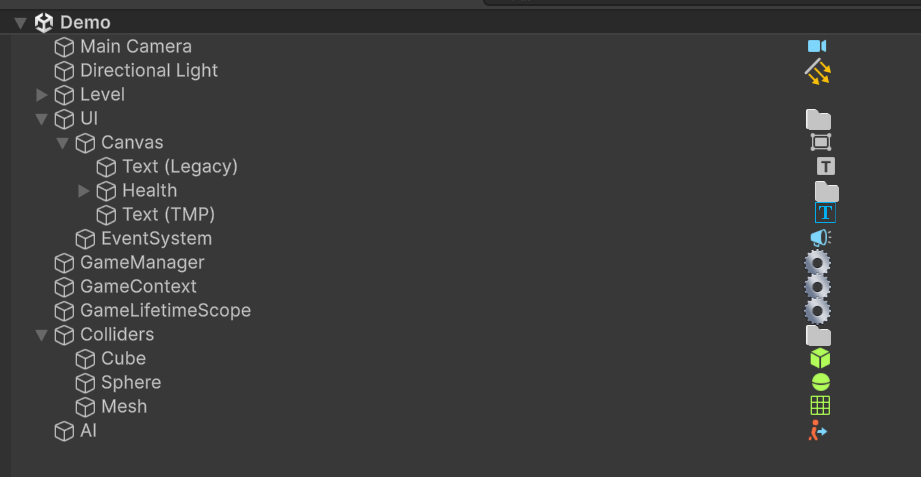

# Hierarchy – Simple Icons (Unity Editor Plugin)

A tiny Unity Editor extension that draws **clean, minimal icons** next to GameObjects in the **Hierarchy** so you can spot important objects at a glance (lights, managers, UI text, and any components you configure).

> ✅ Editor-only • 🚫 No runtime impact • ⚡ Very lightweight

---

## Preview

<!-- Add your screenshots here -->
<!-- Example:
-->

---

## Features

- **Component icons in Hierarchy** (one icon per row, priority-based).
- Uses **Unity built-in editor icons** where possible.
- Special-cases:
  - **Lights** (Directional / Spot / default Light icon)
  - Objects named like **"manager"** / **"lifetimeScope"**
  - **TextMeshPro** (`TMP_Text`)
- **Configurable icon rules** via an `IconsList` asset:
  - just list component type names (e.g. `Camera`, `AudioSource`, `BoxCollider`, …)
- **Caching** of icon lookups for speed.
- If Unity doesn’t have a built-in icon for a component, the rule is automatically skipped.

---

## Installation

### Option A — Unity Asset Store (recommended for most users)
Get it here:

https://assetstore.unity.com/packages/tools/utilities/hierarchy-simple-icons-224856

### Option B — GitHub Releases
Download a `.unitypackage` from **Releases** and import into your project:

https://github.com/CyberYagir/Hierarchy-Icons-Unity-Plugin/releases

### Option C — Manual
Copy the plugin folder (the one containing the editor script) into your project under any `Editor/` directory, for example:

`Assets/Editor/HierarchySimpleIcons/`

---

## Setup / How to use

1. Import the plugin.
2. Make sure you have an `IconsList` asset in the project.
   - The plugin auto-finds it by type (`t:IconsList`).
   - If you have multiple, only the **first found** is used.
3. In `IconsList`, add component type names you want to display icons for, for example:
   - `Camera`
   - `AudioSource`
   - `Rigidbody`
   - `BoxCollider`
   - `Canvas`
   - `NavMeshSurface` *(depends on Unity’s built-in icon availability)*

That’s it — Hierarchy will start showing icons automatically.

---

## How icon mapping works

For component types listed in `IconsList`, the plugin tries to resolve a Unity editor icon key like:

- `d_<TypeName> Icon`

Example:
- `d_Camera Icon`
- `d_AudioSource Icon`

If Unity returns `null` for that icon key, the rule is removed (to avoid repeated slow lookups).

---

## FAQ

### “Do you have built-in icons for AI / Navigation components (e.g. NavMeshSurface)?”
Sometimes yes, sometimes no — it depends on the Unity package/version.
This plugin relies on Unity’s internal icon database. If Unity doesn’t expose an icon for a type, the rule will be ignored automatically.

### “Why is my icon not showing?”
Common reasons:
- The script is not inside an `Editor/` folder.
- `IconsList` asset is missing (plugin has nothing to match against).
- Unity has no built-in icon for that component type.
- Another rule matched earlier (only **one** icon is drawn per row).

---

## Contributing

PRs and issues are welcome:
- Ideas: per-component custom textures, multiple icons per row, custom priority rules, icon alignment presets, etc.

---

## License

MIT License. See `LICENSE` for details.

Copyright (c) Yagir.inc
